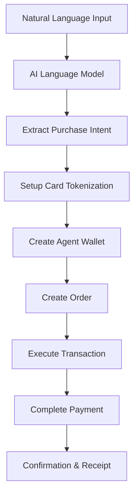

# Crossmint Agent Node for n8n


An n8n community node that enables AI agents to execute autonomous commerce and payments through Crossmint's blockchain infrastructure. This node provides 6 specialized operations for building agents capable of processing natural language purchase instructions and completing transactions end-to-end.

## 🚀 Quick Start

### Prerequisites

- [n8n](https://n8n.io) installed (version 0.190.0 or higher)
- [Crossmint API credentials](https://docs.crossmint.com/api-reference/authentication)
- Node.js 18+ and npm

### Installation

1. **Install the node package:**
   ```bash
   npm install n8n-nodes-crossmint
   ```

2. **Restart n8n** to load the new node

3. **Configure Crossmint credentials** in n8n:
   - Go to Settings → Credentials
   - Add new credential: "Crossmint API"
   - Enter your API key and select environment (Production/Staging)

## 🤖 Building an AI Agent Workflow

This guide shows how to create a complete n8n workflow that enables an AI agent to execute purchases from natural language instructions like "Buy me a wireless mouse from Amazon for under $50".

### Workflow Architecture



### Step-by-Step Workflow Creation

#### 1. Create New Workflow

1. Open n8n and create a new workflow
2. Name it "AI Agent Purchase Workflow"

#### 2. Add Natural Language Processing

**Node: OpenAI (or your preferred LLM)**
- **Operation**: Chat
- **Model**: gpt-4 or gpt-3.5-turbo
- **System Message**:
  ```
  You are a shopping assistant AI. Extract purchase intent from user messages and return structured JSON with:
  {
    "product_query": "specific product description",
    "max_price": "maximum price in USD",
    "platform": "amazon or shopify",
    "recipient_email": "user email address"
  }
  ```
- **User Message**: `{{ $json.user_input }}`

#### 3. Setup Card Tokenization

**Node: Crossmint Agent Node**
- **Operation**: Agent Setup Card Tokenization
- **Purpose**: Get Basis Theory API key for secure card handling

#### 4. Register Card Token (if needed)

**Node: Crossmint Agent Node**
- **Operation**: Agent Register Card Token
- **Card Token**: `{{ $json.tokenized_card }}` (from previous tokenization)
- **Condition**: Only run if new card needs registration

#### 5. Create Agent Wallet

**Node: Crossmint Agent Node**
- **Operation**: Agent Create Wallet
- **Wallet Type**: Custodial
- **Chain**: Polygon (recommended for lower fees)
- **Purpose**: Creates wallet specifically for agent operations

#### 6. Create Purchase Order

**Node: Crossmint Agent Node**
- **Operation**: Agent Create Order
- **Order Recipient**: `{{ $('OpenAI').item(0).json.recipient_email }}`
- **Product Locator**: `amazon:{{ $('Product Search').item(0).json.product_url }}`
- **Agent Payment Method**: card-token
- **Agent Wallet ID**: `{{ $('Create Agent Wallet').item(0).json.id }}`

#### 7. Execute Transaction

**Node: Crossmint Agent Node**
- **Operation**: Agent Execute Transaction
- **Agent Wallet ID**: `{{ $('Create Agent Wallet').item(0).json.id }}`
- **Transaction Data**:
  ```json
  {
    "calls": [
      {
        "transaction": "{{ $('Create Purchase Order').item(0).json.transaction_data }}"
      }
    ],
    "chain": "polygon"
  }
  ```

#### 8. Complete Payment

**Node: Crossmint Agent Node**
- **Operation**: Agent Complete Payment
- **Agent Order ID**: `{{ $('Create Purchase Order').item(0).json.id }}`
- **Card Token**: `{{ $('Register Card Token').item(0).json.token }}`

#### 9. Send Confirmation

**Node: Send Email (or Slack/Discord)**
- **To**: `{{ $('OpenAI').item(0).json.recipient_email }}`
- **Subject**: "Purchase Completed - {{ $('OpenAI').item(0).json.product_query }}"
- **Body**: Include order details and tracking information

### Complete Workflow JSON

```json
{
  "name": "AI Agent Purchase Workflow",
  "nodes": [
    {
      "parameters": {
        "operation": "agentSetupCardTokenization"
      },
      "type": "n8n-nodes-crossmint.crossmintNode",
      "typeVersion": 1,
      "position": [300, 300],
      "id": "setup-tokenization",
      "name": "Setup Card Tokenization",
      "credentials": {
        "crossmintApi": {
          "id": "your-crossmint-credential-id",
          "name": "Crossmint API"
        }
      }
    },
    {
      "parameters": {
        "operation": "agentCreateWallet",
        "walletType": "custodial",
        "chain": "polygon"
      },
      "type": "n8n-nodes-crossmint.crossmintNode",
      "typeVersion": 1,
      "position": [500, 300],
      "id": "create-wallet",
      "name": "Create Agent Wallet",
      "credentials": {
        "crossmintApi": {
          "id": "your-crossmint-credential-id",
          "name": "Crossmint API"
        }
      }
    },
    {
      "parameters": {
        "operation": "agentCreateOrder",
        "orderRecipient": "{{ $json.recipient_email }}",
        "productLocator": "{{ $json.product_locator }}",
        "agentPaymentMethod": "card-token",
        "agentWalletId": "{{ $('Create Agent Wallet').item(0).json.id }}"
      },
      "type": "n8n-nodes-crossmint.crossmintNode",
      "typeVersion": 1,
      "position": [700, 300],
      "id": "create-order",
      "name": "Create Purchase Order",
      "credentials": {
        "crossmintApi": {
          "id": "your-crossmint-credential-id",
          "name": "Crossmint API"
        }
      }
    },
    {
      "parameters": {
        "operation": "agentExecuteTransaction",
        "agentWalletId": "{{ $('Create Agent Wallet').item(0).json.id }}",
        "transactionData": "{{ $('Create Purchase Order').item(0).json.transaction_data }}"
      },
      "type": "n8n-nodes-crossmint.crossmintNode",
      "typeVersion": 1,
      "position": [900, 300],
      "id": "execute-transaction",
      "name": "Execute Transaction",
      "credentials": {
        "crossmintApi": {
          "id": "your-crossmint-credential-id",
          "name": "Crossmint API"
        }
      }
    },
    {
      "parameters": {
        "operation": "agentCompletePayment",
        "agentOrderId": "{{ $('Create Purchase Order').item(0).json.id }}",
        "cardToken": "{{ $json.card_token }}"
      },
      "type": "n8n-nodes-crossmint.crossmintNode",
      "typeVersion": 1,
      "position": [1100, 300],
      "id": "complete-payment",
      "name": "Complete Payment",
      "credentials": {
        "crossmintApi": {
          "id": "your-crossmint-credential-id",
          "name": "Crossmint API"
        }
      }
    }
  ],
  "connections": {
    "Setup Card Tokenization": {
      "main": [
        [
          {
            "node": "Create Agent Wallet",
            "type": "main",
            "index": 0
          }
        ]
      ]
    },
    "Create Agent Wallet": {
      "main": [
        [
          {
            "node": "Create Purchase Order",
            "type": "main",
            "index": 0
          }
        ]
      ]
    },
    "Create Purchase Order": {
      "main": [
        [
          {
            "node": "Execute Transaction",
            "type": "main",
            "index": 0
          }
        ]
      ]
    },
    "Execute Transaction": {
      "main": [
        [
          {
            "node": "Complete Payment",
            "type": "main",
            "index": 0
          }
        ]
      ]
    }
  }
}
```

## 🔧 Agent Operations Reference

### 1. Agent Setup Card Tokenization
**Purpose**: Initialize secure card tokenization system
- **Input**: None
- **Output**: Basis Theory API key and setup configuration
- **Use Case**: First step in payment flow setup

### 2. Agent Register Card Token
**Purpose**: Register a tokenized card for payments
- **Input**: Tokenized card from Basis Theory
- **Output**: Registered token ID
- **Use Case**: Securely store payment method for agent use

### 3. Agent Create Wallet
**Purpose**: Create blockchain wallet for agent operations
- **Input**: Wallet type (custodial/non-custodial), blockchain chain
- **Output**: Wallet ID and address
- **Use Case**: Agent's payment and transaction wallet

### 4. Agent Create Order
**Purpose**: Create purchase order for products
- **Input**: Recipient email, product locator, payment method, wallet ID
- **Output**: Order ID and transaction data
- **Use Case**: Initiate purchase from Amazon/Shopify

### 5. Agent Execute Transaction
**Purpose**: Execute blockchain transaction
- **Input**: Wallet ID, transaction data
- **Output**: Transaction hash and status
- **Use Case**: Process payment on blockchain

### 6. Agent Complete Payment
**Purpose**: Complete payment using tokenized card
- **Input**: Order ID, card token
- **Output**: Payment confirmation and receipt
- **Use Case**: Final payment processing

## 🌐 Environment Configuration

### Staging Environment
- **API Base URL**: `https://staging.crossmint.com/api`
- **Purpose**: Testing and development
- **Features**: Test tokens, sandbox transactions

### Production Environment
- **API Base URL**: `https://www.crossmint.com/api`
- **Purpose**: Live transactions
- **Features**: Real payments, actual product purchases

## 📝 Example Use Cases

### 1. Voice-Activated Shopping
```
User: "Hey agent, order me a bluetooth speaker under $100"
Agent: Processes request → Creates order → Completes purchase
```

### 2. Automated Restocking
```
Inventory System: "Coffee supplies low"
Agent: Searches products → Places order → Confirms delivery
```

### 3. Gift Purchasing
```
Calendar: "Birthday reminder for John"
Agent: Suggests gifts → Gets approval → Purchases and ships
```

## 🔒 Security Best Practices

1. **Credential Management**
   - Store API keys securely in n8n credentials
   - Use staging environment for testing
   - Rotate API keys regularly

2. **Transaction Limits**
   - Set maximum transaction amounts
   - Implement approval workflows for large purchases
   - Monitor agent spending patterns

3. **Error Handling**
   - Implement retry logic for failed transactions
   - Log all agent actions for audit trails
   - Set up alerts for unusual activity

## 🛠️ Development

### Local Testing

1. **Clone the repository:**
   ```bash
   git clone https://github.com/Paella-Labs/n8n-crossmint-nodes.git
   cd n8n-crossmint-nodes
   ```

2. **Install dependencies:**
   ```bash
   npm install
   ```

3. **Build the node:**
   ```bash
   npm run build
   ```

4. **Link for local testing:**
   ```bash
   npm link
   cd ~/.n8n/nodes
   npm link n8n-nodes-crossmint
   ```

5. **Start n8n:**
   ```bash
   n8n start
   ```

### Testing Workflow

1. **Lint code:**
   ```bash
   npm run lint
   ```

2. **Run tests:**
   ```bash
   npm test
   ```

3. **Test with staging credentials:**
   - Use Crossmint staging environment
   - Test with small amounts
   - Verify all operations work end-to-end

## 📚 Additional Resources

- [Crossmint API Documentation](https://docs.crossmint.com/)
- [n8n Node Development Guide](https://docs.n8n.io/integrations/creating-nodes/)
- [Crossmint Agent API Reference](https://docs.crossmint.com/solutions/ai-agents)
- [n8n Workflow Examples](https://n8n.io/workflows/)

## 🤝 Contributing

1. Fork the repository
2. Create a feature branch
3. Make your changes
4. Add tests for new functionality
5. Submit a pull request

## 📄 License

[MIT](LICENSE.md)

## 🆘 Support

- [GitHub Issues](https://github.com/Paella-Labs/n8n-crossmint-nodes/issues)
- [Crossmint Discord](https://discord.gg/crossmint)
- [n8n Community](https://community.n8n.io/)
