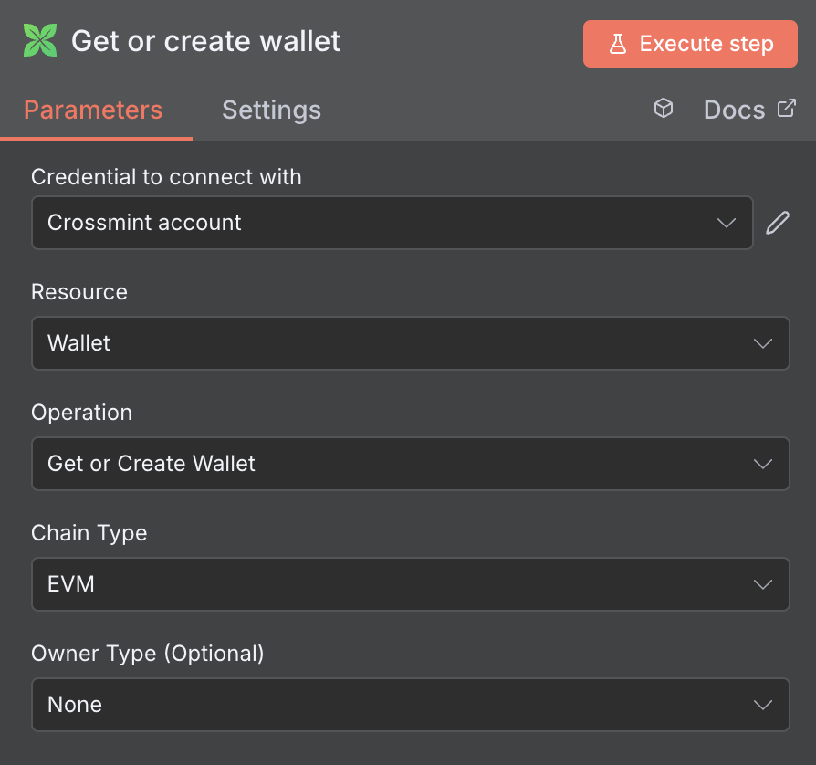
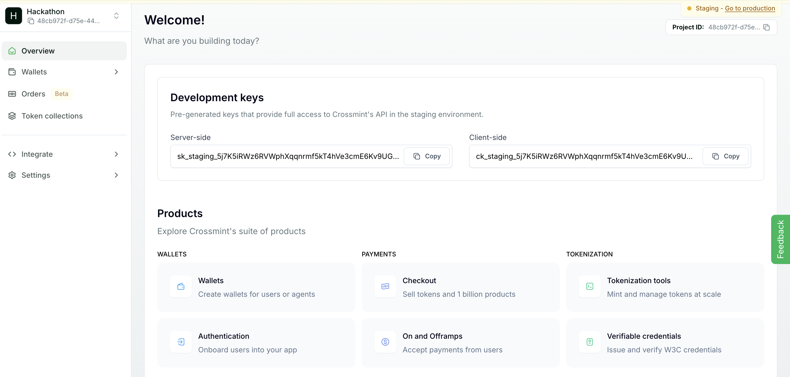
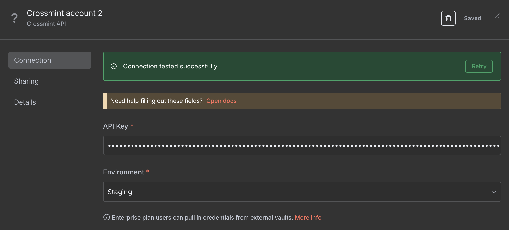
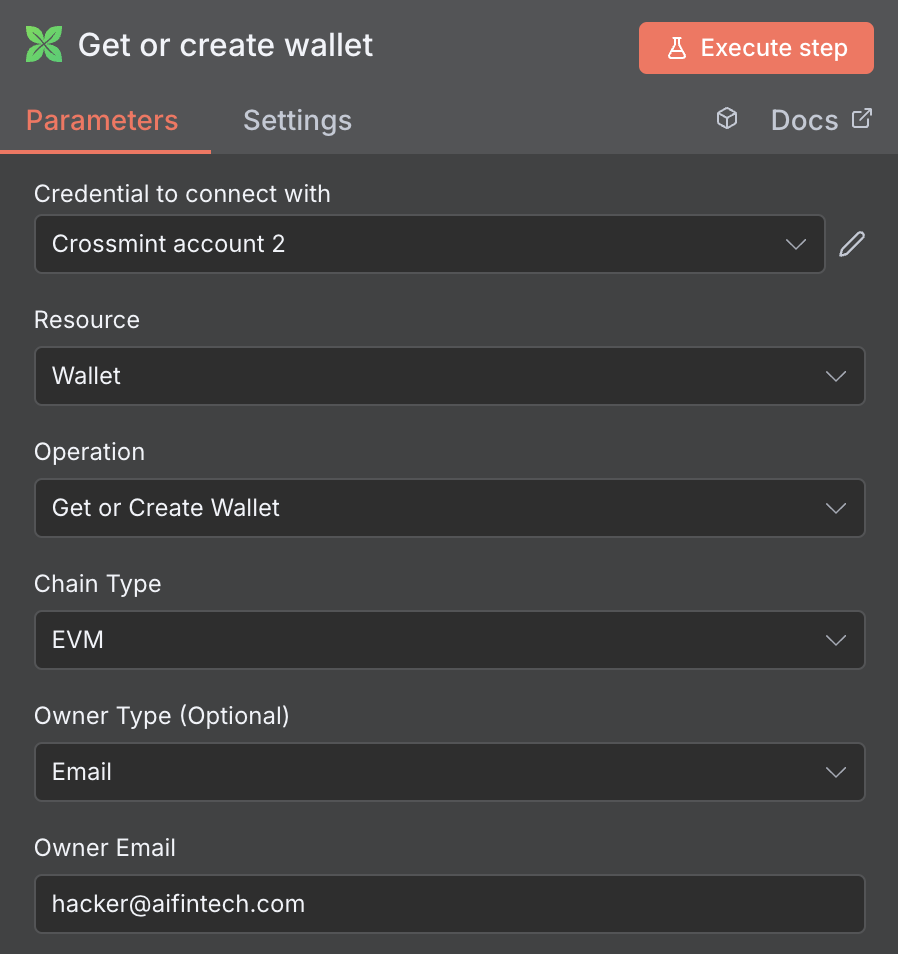
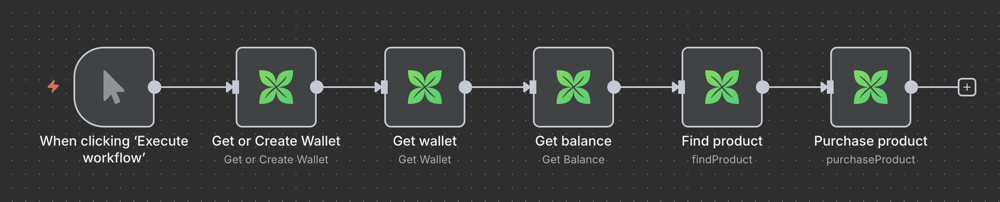
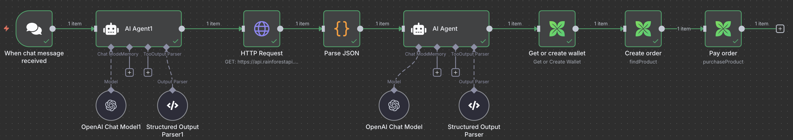

# n8n Community Node for Crossmint

## Table of Contents

- [Installation](#-installation-local-development-setup)
- [Your First Workflow Using Crossmint](#️-your-first-workflow-using-crossmint)
  - [Step 1: Add the Crossmint Node to Your Workflow](#step-1-add-the-crossmint-node-to-your-workflow)
  - [Step 2: Set Up Crossmint Project & Credentials](#step-2-set-up-crossmint-project--credentials)
  - [Getting Test USDC for Staging](#getting-test-usdc-for-staging)
- [Supported Operations](#-supported-operations)
  - [Resource: Wallet](#resource-wallet)
  - [Resource: Checkout](#resource-checkout)
- [API Reference](#-api-reference)
  - [Wallet Operations](#wallet-operations)
  - [Checkout Operations](#checkout-operations)
  - [Additional Resources](#additional-resources)
- [Understanding Wallet Locators](#-understanding-wallet-locators)
  - [Locator Types](#locator-types)
  - [Chain Types](#chain-types)
  - [Best Practices](#best-practices)
- [Example Workflows](#-example-workflows)
- [License](#-license)

This community node for n8n provides a complete integration with Crossmint's **Wallet** and **Checkout** APIs. It allows users and AI agents to program digital money inside wallets, and automate the purchase of physical products all within your n8n workflows.

## 🚀 Installation (Local Development Setup)

First install n8n:
```bash
npm install n8n -g
```

For now you have to run the Crossmint node from source:

1.  **Clone the repository:**
    ```bash
    git clone [https://github.com/YourUsername/n8n-nodes-crossmint.git](https://github.com/YourUsername/n8n-nodes-crossmint.git)
    cd n8n-nodes-crossmint
    ```
2.  **Install dependencies and build:**
    ```bash
    npm install
    npm run build
    ```
3.  **Link your node for testing:**
    ```bash
    npm link
    cd ~/.n8n/custom
    npm link n8n-nodes-crossmint
    ```
    See more detailed instructions and troubleshooting [here](https://docs.n8n.io/integrations/creating-nodes/test/run-node-locally/).

5.  Start n8n in a separate terminal (`n8n start`) and your node will appear.

Note: to run Crossmint nodes, you must be using the self hosted version of n8n. Follow [this guide](https://docs.n8n.io/hosting/installation/npm/#install-globally-with-npm) to set it up.


## ⚙️ Your First Workflow Using Crossmint

Once you've installed the community node, here's how to add and configure your first Crossmint node:

### Step 1: Add the Crossmint Node to Your Workflow

1. In your n8n workflow editor, click the **"+"** button to add a new node
2. Search for **"Crossmint"** in the node library
3. Select the **Crossmint** node from the results

<div align="center">

</div>


4. For this example, we'll use **"Get or Create Wallet"** operation:
   - Set **Resource** to **"Wallet"**
   - Set **Operation** to **"Get or Create Wallet"**

<div align="center">

</div>


### Step 2: Set Up Crossmint Project & Credentials

5. First, create a Crossmint project in Staging:
   - Go to [Crossmint Staging Console](https://staging.crossmint.com/console/overview)
   - Create a new project or select an existing one
   - Copy your **server-side API key** from the project settings

<div align="center">

</div>


6. Back in n8n, in your Crossmint node, click on **"Credential for Crossmint API"** dropdown
7. Select **"Create New"** to add your Crossmint credentials (this will be available for all future Crossmint nodes)

8. In the credential configuration:
   - Enter your Crossmint **API Key** (must be a **server-side** API key)
   - Set **Environment** to **"Staging"** for testing
   - Click **"Save"**

<div align="center">

</div>


9. Complete the wallet configuration (e.g., set Owner Type to "Email" and enter an email address)

<div align="center">

</div>


> **⚠️ Important**: Always use **server-side API keys** from Crossmint. Client-side keys will not work. For initial testing, always use **Staging** environment.

### Getting Test USDC for Staging

To test transactions in staging, you'll need test USDC tokens. You can get them from:

- **Circle Faucet**: [https://faucet.circle.com/](https://faucet.circle.com/) - Get free testnet USDC
- **Crossmint Telegram**: [https://t.me/crossmintdevs](https://t.me/crossmintdevs) - Request USDC from Crossmint

## 💡 Supported Operations

The node is organized into two primary resources: **Wallet** and **Checkout**.

### Resource: Wallet
Operations for managing blockchain wallets which can hold and transfer money (in cryptocurrencies like USDC).

* **Get or Create Wallet**: Creates a non-custodial smart wallet or retrieves an existing one. You maintain full control via a private key that authorizes all transactions. This operation is idempotent.
* **Get Wallet**: Retrieves wallet details using its `walletLocator`.
* **Create Transfer**: Sends tokens (like USDC) between wallets. Requires the wallet's private key to digitally sign and authorize the transfer.
* **Get Balance**: Checks token balances for a wallet across one or more blockchain networks.

### Resource: Checkout
Operations to automate the purchase of products using digital money (e.g. tokens like USDC). This is a two-step process.

* **1. Create Order**:
    * **Function**: Creates a purchase order for a product from Amazon or Shopify.
    * **Key Input**: Product URL or identifier, recipient details (name, email, physical address), and payment details (which cryptocurrency to use and from which wallet to pay).
    * **Key Output**: Returns an order object containing the final price and, most importantly, a `serializedTransaction`. This serialized transaction is the "payment authorization" needed for the next step.

* **2. Pay Order**:
    * **Function**: Executes the payment for a previously created order.
    * **Key Input**: The `serializedTransaction` obtained from the "Create Order" step and the private key to authorize the payment. Among other parameters.
    * **Key Output**: The transaction confirmation once it's submitted to the blockchain, with a `pending` status.

## 📖 API Reference

For detailed information about each operation, parameters, and response formats, refer to the official Crossmint API documentation:

### Wallet Operations
- **Get or Create Wallet**: [Crossmint Wallets API](https://docs.crossmint.com/api-reference/wallets/create-wallet)
- **Get Wallet**: [Crossmint Wallets API - Get Wallet](https://docs.crossmint.com/api-reference/wallets/get-wallet-by-locator)
- **Create Transfer**: [Crossmint Wallets API - Transfer Tokens](https://docs.crossmint.com/api-reference/wallets/transfer-token)
- **Get Balance**: [Crossmint Wallets API - Get Balance](https://docs.crossmint.com/api-reference/wallets/get-wallet-balance)

### Checkout Operations
- **Create Order**: [Crossmint Checkout API - Create Order](https://docs.crossmint.com/api-reference/headless/create-order)
- **Pay Order**: [Crossmint Checkout API - Submit Transaction](https://docs.crossmint.com/api-reference/wallets/create-transaction)

### Additional Resources
- [Supported Chains and Tokens](https://docs.crossmint.com/introduction/supported-chains#supported-chains)

## 🔑 Understanding Wallet Locators

Wallet locators are a key concept used throughout all Crossmint node operations. They provide a flexible way to identify and reference wallets using different types of identifiers.

### Locator Types

| Type | Format | Example | Use Case |
|------|--------|---------|----------|
| **Wallet Address** | `0x...` | `0x1234567890123456789012345678901234567890` | Direct blockchain address reference |
| **Email** | `email:{email}:{chainType}:smart` | `email:user@example.com:evm:smart` | User identification by email |
| **User ID** | `userId:{id}:{chainType}:smart` | `userId:user-123:evm:smart` | Custom user identifier |
| **Phone Number** | `phoneNumber:{phone}:{chainType}:smart` | `phoneNumber:+1234567890:evm:smart` | SMS-based identification |
| **Twitter Handle** | `twitter:{handle}:{chainType}:smart` | `twitter:username:evm:smart` | Social media identification |
| **X Handle** | `x:{handle}:{chainType}:smart` | `x:username:evm:smart` | X (formerly Twitter) identification |


For more detailed information about wallet locator formats and specifications, see: [Crossmint Wallet Locators Documentation](https://docs.crossmint.com/api-reference/wallets/get-wallet-by-locator)

### Chain Types

- **EVM**: Ethereum Virtual Machine compatible chains (Ethereum, Polygon, Base, Arbitrum, etc.)
- **Solana**: Solana blockchain

### Best Practices

1. **Email locators** are ideal for user-friendly identification
2. **Wallet addresses** provide direct blockchain access
3. **User ID locators** work well with existing user management systems
4. Always specify the correct chain type for non-address locators

## 📁 Example Workflows

Ready-to-use workflow examples are available in the `workflows-examples/` folder:

- **`crossmint-nodes-examples.json`**: Complete workflow demonstrating all wallet operations (create wallet, get wallet details, check balance) followed by a checkout flow (create order and pay order).

<div align="center">

</div>

- **`buy-items-from-amazon.json`**: Advanced workflow with AI-powered order processing that accepts free-form messages via Telegram, extracts order details using OpenAI, and automatically purchases Amazon products.

<div align="center">

</div>

To use these examples:
1. Import the JSON file into your n8n instance
2. Configure your Crossmint API credentials
3. Update any personal information (email addresses, wallet addresses, etc.)
4. Execute the workflow

## 📄 License

MIT

-----
