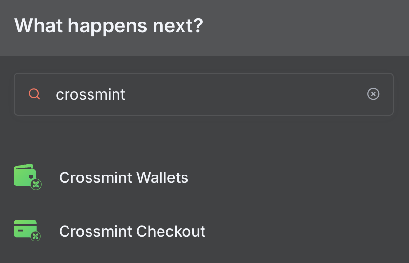
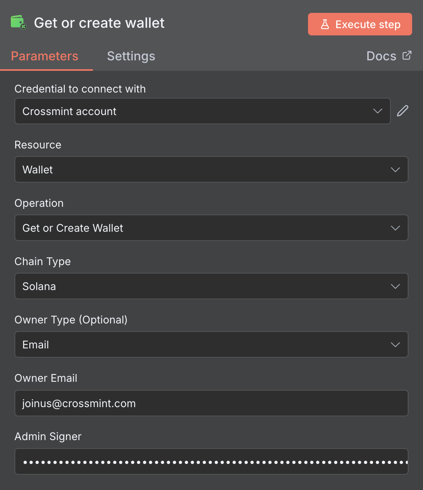

# n8n Community Node for Crossmint

[](https://badge.fury.io/js/n8n-nodes-crossmint)
[](https://opensource.org/licenses/MIT)

This community node for n8n provides a complete integration with Crossmint's **Wallet** and **Checkout** APIs. It enables users and AI agents to seamlessly program digital money inside wallets, automate cryptocurrency transactions, and purchase physical products—all within your n8n workflows.

**Perfect for**: E-commerce automation, payment processing, blockchain wallet management, AI-powered purchasing workflows, and cryptocurrency operations.

## Table of Contents

- [🚀 Installation](#-installation)
- [⚙️ Quick Start Guide](#️-quick-start-guide)
- [💡 Supported Operations](#-supported-operations)
- [🔑 Understanding Wallet Locators](#-understanding-wallet-locators)
- [📁 Example Workflows](#-example-workflows)
- [📖 API Reference](#-api-reference)
- [🛠️ Development Setup](#️-development-setup)
- [🔧 Troubleshooting](#-troubleshooting)
- [🤝 Contributing](#-contributing)
- [📄 License](#-license)

## 🚀 Installation

Note: to run Crossmint nodes, you must be using the self hosted version of n8n. Follow [this guide](https://docs.n8n.io/hosting/installation/npm/#install-globally-with-npm) to set it up.

Then, install the latest Crossmint node from npm:
1.  Open your local n8n
2.  From the menu, go to **Settings > Community Nodes**.
3.  Click on **Install a community node**.
4.  Enter the npm package name: `n8n-nodes-crossmint`.
5.  Click **Install**.

Once installed, the "Crossmint" node will appear in your workflow editor.

## ⚙️ Quick Start Guide

Once you've installed the community node, here's how to create your first Crossmint workflow. This guide works for both manual configuration and AI agent automation:

### Step 1: Add the Crossmint Node to Your Workflow

1. In your n8n workflow editor, click the **"+"** button to add a new node
2. Search for **"Crossmint"** in the node library
3. Select the **Crossmint** node from the results



4. For this example, we'll use **"Get or Create Wallet"** operation:
   - Set **Resource** to **"Wallet"**
   - Set **Operation** to **"Get or Create Wallet"**



### Step 2: Set Up Crossmint Project & Credentials

5. First, create a Crossmint project in Staging:
   - Go to [Crossmint Staging Console](https://staging.crossmint.com/console/overview)
   - Create a new project or select an existing one
   - Copy your **server-side API key** from the project settings


6. Back in n8n, in your Crossmint node, click on **"Credential for Crossmint API"** dropdown
7. Select **"Create New"** to add your Crossmint credentials (this will be available for all future Crossmint nodes)

8. In the credential configuration:
   - Enter your Crossmint **API Key** (must be a **server-side** API key)
   - Set **Environment** to **"Staging"** for testing
   - Click **"Save"**


9. Complete the wallet configuration (e.g., set Owner Type to "Email" and enter an email address)


> **⚠️ Important**: Always use **server-side API keys** from Crossmint. Client-side keys will not work. For initial testing, always use **Staging** environment.

### Getting Test USDC for Staging

To test transactions in staging, you'll need test USDC tokens. You can get them from:

- **Circle Faucet**: [https://faucet.circle.com/](https://faucet.circle.com/) - Get free testnet USDC
- **Crossmint Telegram**: [https://t.me/crossmintdevs](https://t.me/crossmintdevs) - Request USDC from Crossmint

### AI Agent Integration

This node is designed to work seamlessly with AI agents and automated workflows:

- **Programmatic Access**: All operations support programmatic execution for AI agents
- **Structured Responses**: API responses are formatted for easy parsing by AI systems
- **Error Handling**: Comprehensive error messages help AI agents handle edge cases
- **Flexible Locators**: Multiple wallet identification methods support various AI use cases

## 💡 Supported Operations

The node is organized into two primary resources: **Wallet** and **Checkout**. All operations support both manual configuration and programmatic execution by AI agents.

### Resource: Wallet
Operations for managing blockchain wallets which can hold and transfer money (in cryptocurrencies like USDC).

#### **Get or Create Wallet**
- **Purpose**: Creates a new wallet or retrieves an existing one if it's already associated with a user identifier
- **Idempotent**: Safe to call multiple times with the same parameters
- **AI Agent Use**: Perfect for ensuring wallet existence before operations
- **Supported Chains**: EVM (Ethereum, Polygon, Base, Arbitrum) and Solana
- **Example Use Cases**: User onboarding, automated wallet provisioning

#### **Get Wallet**
- **Purpose**: Retrieves detailed information about an existing wallet
- **Input**: Wallet locator (email, userId, address, etc.)
- **Output**: Wallet details including addresses, balances, and metadata
- **AI Agent Use**: Wallet verification and information gathering

#### **Transfer Token**
- **Purpose**: Sends tokens (like USDC) from a Crossmint wallet to any other address or user
- **Supported Tokens**: USDC, USDT, and other supported cryptocurrencies
- **AI Agent Use**: Automated payments, fund distribution, treasury management
- **Security**: Requires proper authentication and sufficient balance

#### **Get Balance**
- **Purpose**: Checks the balance of native and other tokens for a specific wallet
- **Multi-Chain**: Can check balances across multiple blockchains
- **Real-Time**: Returns current on-chain balances
- **AI Agent Use**: Balance verification before transactions, portfolio tracking

### Resource: Checkout
Operations to automate the purchase of products using digital money. Ideal for AI agents handling e-commerce workflows.

#### **1. Create Order**
- **Purpose**: Creates a purchase order for products from Amazon or Shopify
- **Key Inputs**: 
  - Product URL or identifier
  - Recipient details (name, email, physical address)
  - Payment details (cryptocurrency type, source wallet)
- **Key Output**: Order object with final price and `serializedTransaction`
- **AI Agent Use**: Automated product ordering, price calculation, order preparation

#### **2. Pay Order**
- **Purpose**: Executes payment for a previously created order
- **Key Input**: The `serializedTransaction` from Create Order step
- **Key Output**: Transaction confirmation with blockchain status
- **AI Agent Use**: Automated payment execution, order completion workflows

### Advanced Features

#### **Transaction Signing**
- **Private Key Support**: Sign transactions using stored private keys
- **Multi-Chain**: Support for both EVM and Solana transaction signing
- **Security**: Private keys are securely stored in n8n credentials
- **AI Agent Use**: Fully automated transaction workflows

#### **Error Handling**
- **Comprehensive**: Detailed error messages for troubleshooting
- **Structured**: Error responses designed for programmatic handling
- **Recovery**: Clear guidance on resolving common issues

## 📖 API Reference

For detailed information about each operation, parameters, and response formats, refer to the official Crossmint API documentation:

### Wallet Operations
- **Get or Create Wallet**: [Crossmint Wallets API](https://docs.crossmint.com/api-reference/wallets/create-wallet)
- **Get Wallet**: [Crossmint Wallets API - Get Wallet](https://docs.crossmint.com/api-reference/wallets/get-wallet-by-locator)
- **Transfer Token**: [Crossmint Wallets API - Transfer Tokens](https://docs.crossmint.com/api-reference/wallets/transfer-token)
- **Get Balance**: [Crossmint Wallets API - Get Balance](https://docs.crossmint.com/api-reference/wallets/get-wallet-balance)

### Checkout Operations
- **Create Order**: [Crossmint Checkout API - Create Order](https://docs.crossmint.com/api-reference/headless/create-order)
- **Pay Order**: [Crossmint Checkout API - Submit Transaction](https://docs.crossmint.com/api-reference/wallets/create-transaction)

### Additional Resources
- [Supported Chains and Tokens](https://docs.crossmint.com/introduction/supported-chains#supported-chains)

## 🔑 Understanding Wallet Locators

Wallet locators are a key concept used throughout all Crossmint node operations. They provide a flexible way to identify and reference wallets using different types of identifiers.

### Locator Types

| Type | Format | Example | Use Case |
|------|--------|---------|----------|
| **Wallet Address** | `0x...` | `0x1234567890123456789012345678901234567890` | Direct blockchain address reference |
| **Email** | `email:{email}:{chainType}:smart` | `email:user@example.com:evm:smart` | User identification by email |
| **User ID** | `userId:{id}:{chainType}:smart` | `userId:user-123:evm:smart` | Custom user identifier |
| **Phone Number** | `phoneNumber:{phone}:{chainType}:smart` | `phoneNumber:+1234567890:evm:smart` | SMS-based identification |
| **Twitter Handle** | `twitter:{handle}:{chainType}:smart` | `twitter:username:evm:smart` | Social media identification |
| **X Handle** | `x:{handle}:{chainType}:smart` | `x:username:evm:smart` | X (formerly Twitter) identification |
| **Me** | `me:{chainType}:smart` | `me:evm:smart` | API key owner's wallet |

For more detailed information about wallet locator formats and specifications, see: [Crossmint Wallet Locators Documentation](https://docs.crossmint.com/api-reference/wallets/get-wallet-by-locator)

### Chain Types

- **EVM**: Ethereum Virtual Machine compatible chains (Ethereum, Polygon, Base, Arbitrum, etc.)
- **Solana**: Solana blockchain

### Best Practices

1. **Email locators** are ideal for user-friendly identification
2. **Wallet addresses** provide direct blockchain access
3. **"Me" locators** are perfect for API key owner operations
4. **User ID locators** work well with existing user management systems
5. Always specify the correct chain type for non-address locators

## 📁 Example Workflows

Ready-to-use workflow examples are available in the `workflows-examples/` folder. These examples demonstrate both manual configuration and AI agent automation patterns:

### **`crossmint-nodes-examples.json`**
Complete workflow demonstrating all wallet operations followed by checkout flow:
- Create or retrieve wallet
- Check wallet balance
- Transfer tokens between wallets
- Create product order
- Execute payment


**Perfect for**: Learning all operations, testing setup, manual workflows

### **`buy-items-from-amazon.json`** 
Advanced AI-powered workflow for automated purchasing:
- Accepts free-form messages via Telegram
- Uses OpenAI to extract order details
- Automatically purchases Amazon products
- Handles payment with cryptocurrency


**Perfect for**: AI agents, automated purchasing, natural language processing

### Common Workflow Patterns

#### **Basic Wallet Management**
```
1. Get or Create Wallet (with email locator)
2. Get Balance (check available funds)
3. Transfer Token (send payment)
```

#### **E-commerce Automation**
```
1. Create Order (product + recipient details)
2. Get Balance (verify sufficient funds)
3. Pay Order (execute payment)
```

#### **AI Agent Integration**
```
1. Webhook/Trigger (receive instruction)
2. AI Processing (extract details)
3. Wallet Operations (execute transactions)
4. Response (confirm completion)
```

### Setup Instructions

To use these examples:
1. **Import**: Load the JSON file into your n8n instance
2. **Configure Credentials**: Set up your Crossmint API credentials
3. **Customize**: Update personal information (emails, addresses, etc.)
4. **Test**: Execute in staging environment first
5. **Deploy**: Move to production when ready

### AI Agent Considerations

When building AI agent workflows:
- **Error Handling**: Implement robust error checking between operations
- **Validation**: Verify inputs before executing transactions
- **Logging**: Track operations for debugging and audit trails
- **Rate Limiting**: Respect API rate limits in automated workflows

## 🛠️ Development Setup

### Prerequisites

- Node.js >= 20.15
- npm or yarn package manager
- Git
- A local n8n installation

### Local Development

1. **Clone the repository:**
   ```bash
   git clone https://github.com/Crossmint/n8n-nodes-crossmint.git
   cd n8n-nodes-crossmint
   ```

2. **Install dependencies:**
   ```bash
   npm install
   ```

3. **Build the project:**
   ```bash
   npm run build
   ```

4. **Link for local testing:**
   ```bash
   npm link
   cd ~/.n8n/custom
   npm link n8n-nodes-crossmint
   ```

5. **Start n8n in development mode:**
   ```bash
   export N8N_LOG_LEVEL=debug
   n8n start
   ```

### Development Commands

- `npm run build` - Build TypeScript and copy assets
- `npm run dev` - Watch mode for development
- `npm run lint` - Run ESLint checks
- `npm run lintfix` - Fix auto-fixable lint issues
- `npm test` - Run Jest tests
- `npm run format` - Format code with Prettier

### Project Structure

```
├── credentials/           # Credential type definitions
│   ├── CrossmintApi.credentials.ts
│   └── CrossmintPrivateKeyApi.credentials.ts
├── nodes/Crossmint/      # Node implementation
│   ├── CrossmintNode.node.ts
│   ├── CrossmintNode.node.json
│   └── logo.svg
├── test/                 # Test files
├── workflows-examples/   # Example workflows
├── dist/                 # Build output
└── package.json          # Package configuration
```

### Testing Your Changes

1. **Unit Tests:**
   ```bash
   npm test
   ```

2. **Local Testing:**
   - Start n8n with your linked node
   - Create test workflows
   - Use staging environment for API calls

3. **Lint and Format:**
   ```bash
   npm run lint
   npm run format
   ```

For detailed development guidelines, see the [n8n community node documentation](https://docs.n8n.io/integrations/creating-nodes/).

## 🔧 Troubleshooting

### Common Issues

#### **Node Not Appearing in n8n**
- **Cause**: Installation or linking issues
- **Solution**: 
  1. Restart n8n after installation
  2. Check n8n logs for errors
  3. Verify node is in `~/.n8n/nodes` directory
  4. Try reinstalling: `npm uninstall n8n-nodes-crossmint && npm install n8n-nodes-crossmint`

#### **"Invalid API Key" Errors**
- **Cause**: Wrong API key type or environment mismatch
- **Solution**:
  1. Ensure you're using a **server-side** API key (not client-side)
  2. Verify environment setting (Staging vs Production)
  3. Check API key hasn't expired
  4. Test API key directly with Crossmint API

#### **Wallet Creation Failures**
- **Cause**: Invalid locator format or missing parameters
- **Solution**:
  1. Check wallet locator format (e.g., `email:user@example.com:evm:smart`)
  2. Ensure chain type is specified correctly
  3. Verify email/userId format is valid
  4. Try with a different locator type

#### **Transaction Failures**
- **Cause**: Insufficient balance, network issues, or invalid parameters
- **Solution**:
  1. Check wallet balance before transfers
  2. Verify recipient address format
  3. Ensure sufficient gas/transaction fees
  4. Check network status and try again

#### **Checkout Issues**
- **Cause**: Invalid product URLs, shipping restrictions, or payment problems
- **Solution**:
  1. Verify product URL is accessible
  2. Check shipping address format
  3. Ensure wallet has sufficient balance
  4. Confirm product is available for purchase

### Network and Environment Issues

#### **Connection Timeouts**
- Check internet connectivity
- Verify firewall settings allow HTTPS traffic
- Try switching between staging and production environments

#### **Rate Limiting**
- Implement delays between API calls
- Use exponential backoff for retries
- Monitor API usage in Crossmint Console

### Getting Help

- **GitHub Issues**: [Report bugs and request features](https://github.com/Crossmint/n8n-nodes-crossmint/issues)
- **Crossmint Support**: support@crossmint.com
- **n8n Community**: [n8n Community Forum](https://community.n8n.io/)
- **Documentation**: [Crossmint API Docs](https://docs.crossmint.com/)

## 🤝 Contributing

We welcome contributions! Here's how to get started:

### Quick Contribution Guide

1. **Fork the repository** on GitHub
2. **Clone your fork** locally
3. **Create a feature branch**: `git checkout -b feature/your-feature-name`
4. **Make your changes** and test thoroughly
5. **Run quality checks**:
   ```bash
   npm run lint
   npm test
   npm run build
   ```
6. **Commit your changes**: `git commit -m "feat: add new feature"`
7. **Push to your fork**: `git push origin feature/your-feature-name`
8. **Create a Pull Request** on GitHub

### Development Guidelines

- **Code Style**: Follow existing patterns and use Prettier for formatting
- **Testing**: Add tests for new features and ensure existing tests pass
- **Documentation**: Update README and code comments as needed
- **Commits**: Use conventional commit messages (feat:, fix:, docs:, etc.)

### Areas for Contribution

- **New Operations**: Additional Crossmint API integrations
- **Error Handling**: Improved error messages and recovery
- **Documentation**: Examples, guides, and API documentation
- **Testing**: Additional test coverage and edge cases
- **Performance**: Optimization and efficiency improvements

### Code of Conduct

This project follows the [Contributor Covenant Code of Conduct](CODE_OF_CONDUCT.md). Please be respectful and inclusive in all interactions.

## 📄 License

MIT - see [LICENSE.md](LICENSE.md) for details.

---

**Built with ❤️ by the Crossmint team**

*This node enables seamless integration between n8n workflows and Crossmint's blockchain infrastructure, supporting both human users and AI agents in building the future of automated digital commerce.*
